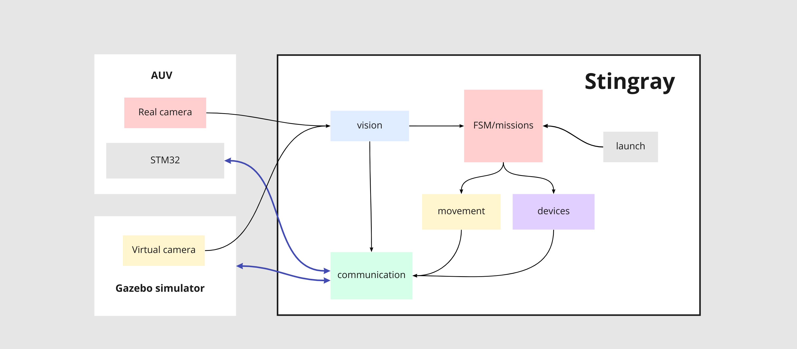
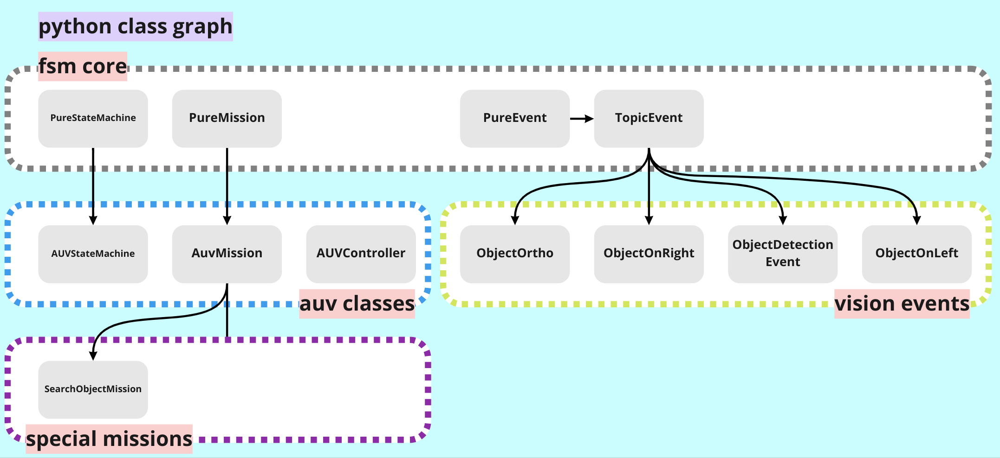

# stingray

Stingray is a ROS based framework for autonomous underwater vehicles (AUV)

<div align="center">
    
</div>

## Dependencies
- [ROS Noetic](https://wiki.ros.org/noetic) - base framework
- [YOLOv5](https://github.com/ultralytics/yolov5) - for object detection
- [pytransitions](https://github.com/pytransitions/transitions) - for state machine


# Setup Stingray framework

- Initialize and update git submodules used in project:
```bash
git submodule update --init --recursive
```

- Install **requirements** from [yolov5](https://github.com/ultralytics/yolov5)


- Install ros packages:

```bash
sudo apt-get install ros-noetic-serial ros-noetic-usb-cam ros-noetic-rosbridge-server ros-noetic-image-view ros-noetic-actionlib ros-noetic-zbar-ros
```

- Install pytransitions dependencies

```bash
sudo apt install graphviz-dev
pip3 install pygraphviz transitions
```

- Build

```bash
source /opt/ros/noetic/setup.bash
catkin_make
```
Setup workspace before you start to work:

```bash
source install/setup.bash
```

# Run
> See the example of custom launch file [here](https://github.com/hydronautics-team/sauvc/blob/4abe9ef8e696a0c40c444ce8b6b267f75ae0db48/src/sauvc_startup/launch/main.launch)

## Run with Gazebo simulation:

* Clone and build our [simulator](https://github.com/hidronautics/simulator) (now it's only for sauvc competition).
* Run simulator.


```bash
roslaunch stingray_startup main.launch simulation:=true 
```

## Run with qr codes

[➦ Full description here](#launch-with-qrtrigger-node)

Use arg:
```bash
qr_launch:=true 
```
Show your qr code to vehicle camera. 

If `stop` qr code has been detected then the running launch file will be stopped.

### Other args:
- `hardware_connection:=false` - disable connection btw jetson and stm32 via serial (uart_driver) 
- `stream:=true` - enable web video stream from all cameras 
- `debug:=true` - enable image_view nodes and publishing output videos after object detection
- `file_cam:=true` - provide input videos from file
- `record_raw:=true` - enable recording video from all cameras 
- `record_output:=true` - enable recording video after object detection 

## Launch system

`stingray_startup` package contains launch files for running the whole system.

### Main launch file

Use `main.launch` as the base for your custom launch file.
Include like this:

```xml
<!-- MAIN -->
    <include file="$(find stingray_startup)/launch/main.launch">
        <arg name="ROS_OUTPUT" value="$(arg ROS_OUTPUT)" />
        <arg name="DEBUG" value="$(arg DEBUG)" />
        <arg name="STREAM" value="$(arg STREAM)" />
        <arg name="SIMULATION" value="$(arg SIMULATION)" />
        <arg name="HARDWARE_CONNECTION" value="$(arg HARDWARE_CONNECTION)" />
        <arg name="QR_LAUNCH" value="$(arg QR_LAUNCH)" />
        <arg name="QR_CAMERA" value="$(arg QR_CAMERA)" />
        <arg name="QR_LAUNCH_PACKAGE_NAME" value="$(arg QR_LAUNCH_PACKAGE_NAME)" />
        <arg name="QR_NAME_PATTERN" value="$(arg QR_NAME_PATTERN)" />
    </include>
```

*see args [inside launch file](src/utils/stingray_startup/launch/main.launch) or [below](#other-args)

### Camera launch file

Add camera to your custom launch file file like that:

```xml
<!-- FRONT CAMERA -->
    <include file="$(find stingray_startup)/launch/camera.launch">
        <arg name="REAL_CAM" value="true" unless="$(arg SIMULATION)" />
        <arg name="SIMULATION_CAM" value="true" if="$(arg SIMULATION)" />

        <arg name="CAMERA_NAME" value="$(arg FRONT_CAMERA)" />
        <arg name="CAMERA_PATH" value="$(arg FRONT_CAMERA_PATH)" />
        <arg name="CAMERA_TOPIC" value="$(arg FRONT_CAMERA_TOPIC)" />

        <arg name="ROS_OUTPUT" value="$(arg ROS_OUTPUT)" />
        <arg name="SHOW" value="$(arg SHOW)" />
        <arg name="DEBUG" value="$(arg DEBUG)" />
        <arg name="RECORD_RAW" value="$(arg RECORD_RAW)" />
        <arg name="RECORD_OUTPUT" value="$(arg RECORD_OUTPUT)" />
        <arg name="RECORD_DIR" value="$(arg RECORD_DIR)" />
    </include>
```

Specify camera args: `CAMERA_NAME`, `CAMERA_PATH`, `CAMERA_TOPIC`.

Also, you can specify the camera type: `REAL_CAM`, `SIMULATION_CAM` or `FILE_CAM`.

`RECORD` args for recording video from camera.

### Object detection launch file

Add object detection to your custom launch file file like that:

```xml
<!-- OBJECT DETECTION -->
    <include file="$(find stingray_startup)/launch/object_detection.launch">
        <arg name="IMAGE_TOPIC_LIST" value="$(arg FRONT_CAMERA_TOPIC) $(arg BOTTOM_CAMERA_TOPIC)" />
        <arg name="WEIGHTS_PACKAGE_NAME" value="$(arg WEIGHTS_PACKAGE_NAME)" />
        <arg name="ROS_OUTPUT" value="$(arg ROS_OUTPUT)" />
        <arg name="DEBUG" value="$(arg DEBUG)" />
    </include>
```

Provide the list of topics to subscribe to: `IMAGE_TOPIC_LIST`.
Provide the name of the package with weights: `WEIGHTS_PACKAGE_NAME`.


## Setup yolov5 object detection:
- Edit [config.yaml](src/vision/stingray_object_detection/weights/config.yaml) to add your labels
- Put best checkpoint of yolov5 as **best.pt** in [weights folder](src/vision/stingray_object_detection/weights)

# Structure

<div align="center">
    
</div>

# Packages

## stingray_communication

Nodes:
- harware_bridge - abstract bridge node between hardware and ros
- uart_driver - node for communication with stm32 via uart

## stingray_gazebo_communication

Contain `gazebo_bridge` node for communication with gazebo simulator.

## stingray_devices

Contain nodes for working with lifter device.

## stingray_tfsm

<div align="center">
    
</div>

FSM package allows you to create a missions for robot.
- `AUVController` class is a high-level mission controller. 
- `AUVMission` allows you to create custom missions.
- `TopicEvent` listens to the topic and triggers the event when the message is received. Allows you to create custom events.

Use `ObjectDetectionEvent` to trigger the event when the object is detected.

## stingray_movement

Contains c++ nodes for controlling robot movement - `basic`, `common` and `patterns`.

## stingray_resources

Contains config files and util libs

Config files:
- `control.json` - all stuff for control algos and control system
- `hardware.json` - all stuff for different devices, hardware communication and etc.
- `ros.json` - names for ROS topics, services, actions
- `simulation.json`- all stuff for simulation mode

Libs:
- `utils.py` - util python methods
    - `load_config` - loads config file with name

## stingray_startup

Contains launch files and qr trigger node.

Launch files:
- `main.launch`
- `camera.launch`
- `object_detection.launch`

## stingray_utils

Contains util libs and nodes.

- `json.hpp` - cpp lib for json files

### Launch with qr_trigger node

Qr trigger node has parameters:
- `launch_pkg_name` - package name with *launch/* directori which contains launch files you want to trigger  
- `name_pattern` - specify this prefix to trigger specific launch files

Generate qr code from launch file name without custom prefix and *.launch*. 

> Example: you have `stingray_qr_mission.launch` file. **stingray_qr_** is the prefix which you pass to qr_trigger node as `name_pattern` parameter. Also you don't need **.launch** to generate qr code. Eventually you need to generate `mission` to qr code

Launch `main.launch` with param:
```bash
qr_launch:=true 
```
and you'll able to trigger launch files with qr codes.

If `stop` has been detected then running launch file will be stopped.

## stingray_video_recorder

Contains node for recording video from camera.
