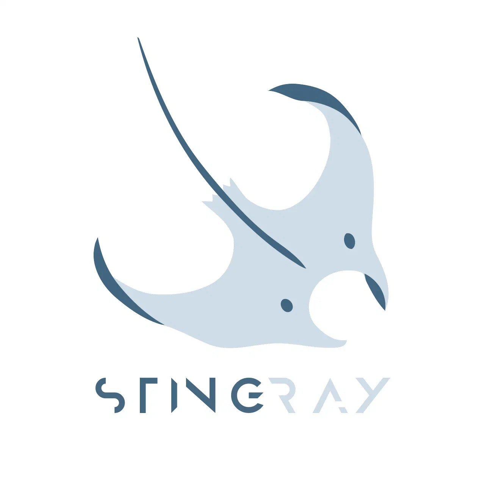

# stingray
Autonomous underwater vehicle platform based on ROS



## Building
Install dependencies:

```bash
sudo apt install graphviz-dev
pip3 install pygraphviz transitions
sudo apt install ros-noetic-zbar-ros
```

```bash
sudo apt-get install ros-$ROS_DISTRO-usb-cam ros-$ROS_DISTRO-rosbridge-server ros-$ROS_DISTRO-image-view ros-$ROS_DISTRO-actionlib ros-$ROS_DISTRO-smach ros-$ROS_DISTRO-smach-viewer
```
Initialize and update git submodules used in project:
```bash
git submodule init
git submodule update
```
Use following commands to build:
```bash
source /opt/ros/$ROS_DISTRO/setup.bash
catkin_make
```
Do not forget to setup workspace before you start to work:
```bash
source devel/setup.bash
```
