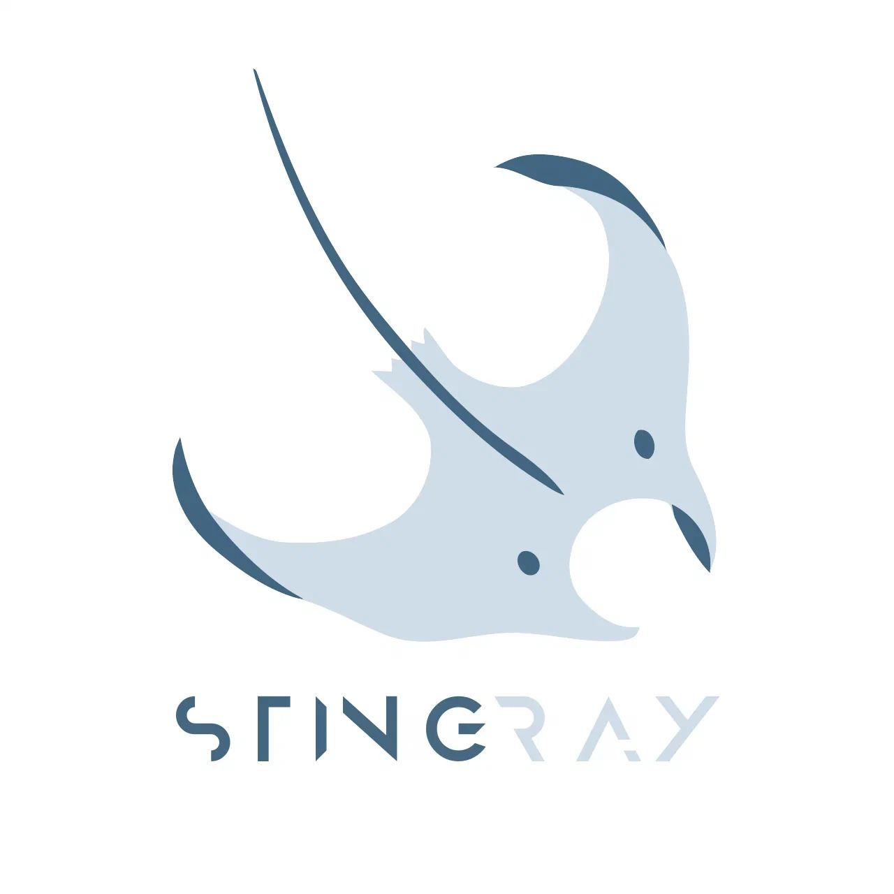

# stingray

<div align="center">
  
</div>

Stingray is a ROS 2 AUV control stack built around mission orchestration, action
servers for movement/devices, object detection, and video recording. This
repository currently contains the first-party packages listed below plus two
external code trees that are used by object detection.

## Scope of This README

- This document describes the packages that live in this repository today.
- Direct code review scope excluded `src/stingray_core`.
- Deep review also excluded third-party detector code in
  `src/stingray_object_detection/ultralytics` and vendored `yolov5`.
- Known defects and architectural risks are tracked in [ISSUES.md](ISSUES.md).

## Repository Map

| Package | Kind | Main entry points | Notes |
| --- | --- | --- | --- |
| `stingray_cam` | ROS 2 Python package | Camera calibration data | Ships `configs/camera.yaml`; no runtime node in this package. |
| `stingray_devices` | ROS 2 C++ package | `device_action_server` | Bridges `DeviceAction` requests to `stingray_core_interfaces/SetDevice`. |
| `stingray_interfaces` | ROS 2 interface package | Actions, messages, services | Shared contract for missions, movement, devices, detector, and recorder control. |
| `stingray_launch` | ROS 2 Python package | `cam.launch.py`, `control.launch.py`, `missions.launch.py`, `od.launch.py`, `recorder.launch.py`, `zbar.launch.py` | Main bring-up/orchestration layer. |
| `stingray_missions` | ROS 2 Python package | `fsm_node`, `qr_trigger_node` | Loads scenario YAML, drives the finite-state machine, and invokes actions/services. |
| `stingray_movement` | ROS 2 C++ package | `twist_action_server`, `bbox_centering_twist_action_server`, `bbox_search_twist_action_server` | Movement actions backed by `stingray_core_interfaces/SetTwist`. |
| `stingray_object_detection` | ROS 2 Python package | `yolov8_detector` | Publishes `BboxArray` from image topics; also contains the `ultralytics` submodule and vendored `yolov5`. |
| `stingray_recorder` | ROS 2 Python package | `video_recorder_node` | Records image topics on demand via `EnableTopic`. |
| `stingray_utils` | Mixed ROS 2 package | C++ headers, Python helpers, `stingray_utils.launch.py` | Shared helpers used by missions/movement; packaging is currently inconsistent, see `ISSUES.md`. |

## Architecture Overview

The current first-party control path is:

1. `stingray_launch` starts operators, action servers, cameras, detector, and
   recorder nodes.
2. `stingray_missions/fsm_node` loads scenarios from
   `stingray_missions/configs/scenarios/*.yaml`.
3. Scenario states reference mission YAML in
   `stingray_missions/configs/missions/*.yaml`.
4. Mission actions call movement/device action servers or publish
   `EnableTopic` messages to toggle detection/recording.
5. `stingray_movement` and `stingray_devices` turn those actions into
   `stingray_core_interfaces` service calls.
6. `stingray_object_detection` subscribes to image and camera info topics and
   publishes `*/bbox_array`.
7. `stingray_recorder` subscribes to image topics and records when enabled.

The stack relies on `stingray_core_interfaces` for the low-level control and
state contracts, but `src/stingray_core` itself is outside the scope of this
repository review.

## Launch Files

The active launch entry points in this repository are:

| Launch file | Purpose | Notes |
| --- | --- | --- |
| `cam.launch.py` | Start a single `usb_cam` node with calibration file support. | Defaults to `/dev/video0` and `/stingray/topics/camera`. |
| `od.launch.py` | Start `yolov8_detector`. | Expects image topics, camera info topics, and detector asset files. |
| `recorder.launch.py` | Start `video_recorder_node`. | Uses `EnableTopic` to start/stop recording. |
| `control.launch.py` | Bring up the full reviewed control stack. | Includes FSM, QR trigger, movement action servers, and device action server. |
| `missions.launch.py` | Bring up the mission FSM without the full control stack. | Overlaps with `control.launch.py`; see `ISSUES.md`. |
| `zbar.launch.py` | Start QR / barcode reader integration. | Publishes decoded barcode strings to the configured topic. |

Typical commands:

```bash
ros2 launch stingray_launch cam.launch.py
ros2 launch stingray_launch od.launch.py
ros2 launch stingray_launch recorder.launch.py
ros2 launch stingray_launch control.launch.py
ros2 launch stingray_launch missions.launch.py
ros2 launch stingray_launch zbar.launch.py
```

Most launch files accept topic, service, and device overrides through launch
arguments. Check the corresponding `src/stingray_launch/launch/*.py` file before
deploying to hardware.

## Interfaces and Control Contracts

The public ROS contracts defined in `stingray_interfaces` are:

- `TwistAction`: generic movement command.
- `BboxCenteringTwistAction`: center on a detected object.
- `BboxSearchTwistAction`: search for a detected object by yaw sweep.
- `DeviceAction`: actuate a device through the device action server.
- `HydroacousticCenteringTwistAction`: declared interface; implementation
  status is tracked in `ISSUES.md`.
- `SetTransition`: service used by the mission FSM and QR trigger.
- `Bbox`, `BboxArray`: detector outputs.
- `EnableTopic`: enable/disable object detection or recording for a topic.

## Missions and Scenarios

Mission and scenario behavior is configured in YAML:

- Missions: `src/stingray_missions/configs/missions/*.yaml`
- Scenarios: `src/stingray_missions/configs/scenarios/*.yaml`

Built-in reviewed scenarios include:

- `init`
- `check`
- `check_vision`
- `start_video_recording`
- `stop_video_recording`

`fsm_node` wires those YAML definitions to action clients and service clients.
`qr_trigger_node` can request transitions by sending strings to the
`SetTransition` service.

## Setup

This repository uses ROS 2 package layouts (`ament_cmake`, `ament_python`,
`rosidl_generate_interfaces`) and assumes a ROS 2 workspace with
`stingray_core_interfaces` available.

Expected external/runtime dependencies visible from the reviewed code include:

- ROS 2 core packages (`rclpy`, `rclcpp`, `rosidl`, `launch_ros`)
- `cv_bridge`, `sensor_msgs`, `std_msgs`, `std_srvs`
- `usb_cam`
- `zbar_ros`
- `transitions`
- `torch`
- `ultralytics`
- `filterpy`

Initialize submodules before building:

```bash
git submodule update --init --recursive
```

Typical ROS 2 workspace build flow:

```bash
colcon build --packages-up-to stingray_launch
source install/setup.bash
```

Notes:

- Detector runtime also expects files under
  `src/stingray_object_detection/weights`.
- Build and dependency metadata are currently inconsistent across packages; use
  `ISSUES.md` as the source of truth for known packaging gaps.
- This review was performed in an environment without `/opt/ros` and without
  `colcon`, so the build flow above was not validated locally.

## Operational Notes

- Object detection is toggled through `EnableTopic` messages on
  `/stingray/topics/enable_object_detection`.
- Recording is toggled through `EnableTopic` messages on
  `/stingray/topics/enable_recording`.
- Detector output topics follow the pattern `<image_topic>/bbox_array`.
- Debug image topics follow the pattern `<image_topic>/debug_image`.
- Camera calibration lives in `src/stingray_cam/configs/camera.yaml`.

## Known Limitations

This README intentionally documents the repository as it exists today instead of
describing an idealized or historical layout. Several runtime, packaging, and
architecture problems remain unresolved, including broken launch wiring,
detector asset packaging problems, inconsistent package metadata, and missing
integration tests.

See [ISSUES.md](ISSUES.md) for the package-by-package review findings.
